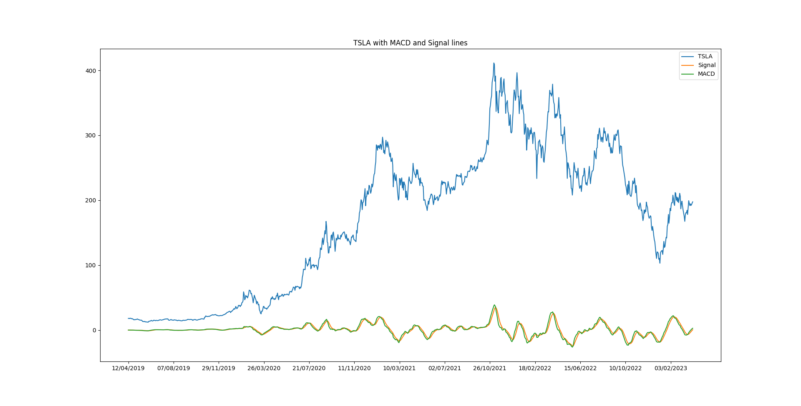

# MACD Indicator

The Moving Average Convergence/Divergence (MACD) is a widely used technical indicator in financial markets to analyze price trends, measure trend momentum, and identify potential buy or sell signals.

## Introduction

The MACD indicator consists of two lines: the MACD line and the signal line. By analyzing the relationship between these lines, traders can gain insights into the direction and strength of price trends, facilitating decision-making regarding market entry and exit points.

## How MACD Works

The MACD is derived from two exponential moving averages (EMAs): a short-term EMA (typically based on 12 periods) and a long-term EMA (typically based on 26 periods). The MACD line is the difference between these two EMAs, while the signal line is typically a 9-period EMA of the MACD line.

- **MACD Line**: Represents the difference between the 12-period and 26-period EMAs.
- **Signal Line**: A 9-period EMA of the MACD line.

### Interpretation

- When the MACD line crosses above the signal line, it is often considered a bullish signal, indicating potential buying opportunities.
- When the MACD line crosses below the signal line, it is considered a bearish signal, suggesting potential selling opportunities.

## Example

This image displays the historical price of TSLA stock along with the calculated MACD and signal lines.
